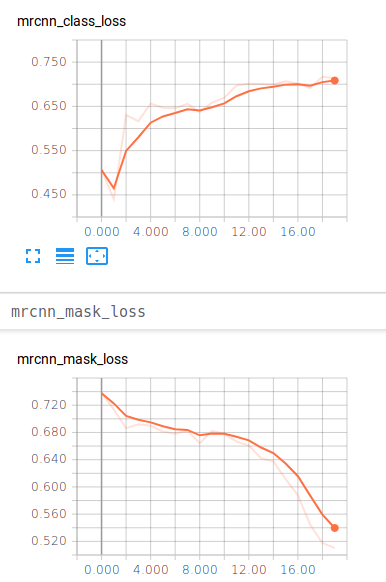
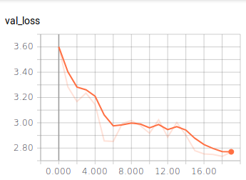

# TODO:
- Train 3 stages sequentially for better results
- affinity clustering on mask or activation maps ??
- Update for W-Net architecture.

# Results
## Food256 (stage= heads, resnet50, epochs= 20)
- Class loss increasing needs stage 2 training
- Mask loss going down. More improvements possible.
- Overall validation loss decreasing
- mAP 0 since class predictions are off.
- Check customs/inspect_model.ipynb for visualizations

